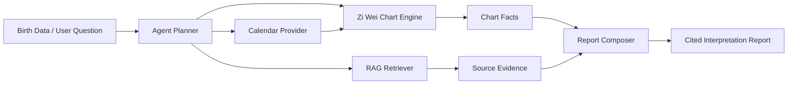

# Architecture

XuanAgent is organized around a strict boundary between deterministic computation and language-model interpretation.

## Packages

- `@xuan/core`: domain model, rulesets, chart generation, validation, source facts.
- `@xuan/rag`: corpus metadata, chunking, retrieval interface, citation types.
- `@xuan/agent`: tool planning, chart tools, retrieval tools, report composition.
- `@xuan/cli`: developer commands and demos.
- `@xuan/mcp`: MCP tool surface for AI assistants.

## Accuracy Strategy

Zi Wei Dou Shu is formula-heavy and school-dependent. The engine should never hide uncertainty. Every computed field should carry:

- `rulesetId`
- `formulaId`
- `sourceHint`
- `confidence`
- optional `notes`

When schools disagree, the project should expose multiple rulesets instead of flattening them into one undocumented answer.
