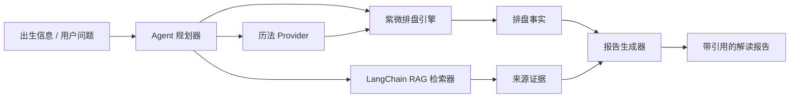

# 架构

XuanAgent 的核心边界是：确定性计算和语言模型解读必须分离。

## 包划分

- `@xuan/core`：领域模型、规则集、排盘生成、校验和事实结构。
- `@xuan/rag`：语料元数据、文本切分、检索接口、引用类型和 LangChain.js 适配层。
- `@xuan/agent`：工具规划、排盘工具、检索工具和报告组装。
- `@xuan/cli`：开发者命令行和 demo。
- `@xuan/mcp`：面向外部 AI 助手的 MCP 工具接口。

## 准确性策略

紫微斗数公式密集，而且不同流派之间会有差异。引擎不能隐藏不确定性。每个计算字段都必须携带：

- `rulesetId`
- `formulaId`
- `sourceHint`
- `confidence`
- 可选 `notes`

当流派规则不一致时，项目应该暴露多个 ruleset，而不是把差异压平成一套没有出处的答案。

当前第一版实现使用 `ziwei.common-v0` 生成可追溯的核心事实，并把历法换算保留在 provider 接口之后。直到加入经过 fixtures 校验的 provider 之前，太阳历转农历和真太阳时都必须由显式 provider 提供。

## RAG 与 Agent 边界

RAG 层优先采用 LangChain.js：

- `RagIndex` 可以转换为 LangChain `Document`。
- 本地检索器可以包装为 LangChain `BaseRetriever`。
- `xuan_rag_search` tool 返回原文片段、citation 和来源使用范围。

LangChain/后续 LangGraph 只负责编排检索和工具调用，不参与排盘公式推断。解释层必须同时拿到排盘事实和 RAG citation；如果某条断语找不到对应事实或 citation，应标记为无依据，而不是让 LLM 补全。
