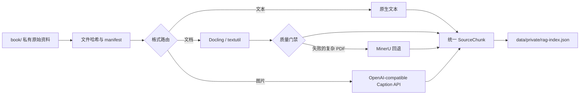

# 资料提取与图片 Caption 管道

本文记录 XuanAgent 私有资料进入 RAG 前的提取路线、数据契约和安全边界。当前已经接入 Docling 文档 worker、macOS 旧 Office 回退、OpenAI-compatible Caption provider、artifact loader 和统一私有索引；Apache Tika 与 MinerU 仍是后续可选适配器。

## 技术决策

2026-07-13 确定以下路线：

| 输入 | 主处理器 | 回退 | 输出用途 |
| --- | --- | --- | --- |
| TXT、Markdown | Node.js 原生文本读取 | 无 | 原文检索 |
| PDF | Docling，无 OCR | 显式 `--ocr` / MinerU | 保留页码、版面和结构的文本块 |
| DOCX、PPTX | Docling | Apache Tika | 结构化文本块 |
| 旧 DOC、PPT | macOS `textutil` | Apache Tika | 文本块 |
| PNG、JPG、JPEG、WebP | OpenAI-compatible Caption API | 后续本地模型 | 图片语义检索 |

Docling 作为主文档解析器，是因为其统一文档模型能够表达页码、版面和来源定位，并且许可证适合开源项目。当前机器没有 Java，因此旧 DOC/PPT 先使用 macOS 自带 `textutil`；跨平台部署时再接 Apache Tika。MinerU 只作为可选本地插件，避免把带附加条件的许可证和较重运行时变成核心依赖。

## 数据流



所有原始资料、提取正文、Caption、embedding 和索引都只能保存在 Git ignored 的本地私有目录。

## Caption 的角色

图片不做 OCR。Caption 用于回答“这张图大概展示什么、与哪些主题相关”，方便语义召回和案例浏览。

Caption 不得承担以下职责：

- 从命盘图反推出出生信息。
- 生成十二宫、星曜落宫或四化等确定性排盘事实。
- 在没有人工复核时，把图片中的细小文字当作准确原文引用。
- 替代 `@xuan/core` 的排盘结果。

Caption chunk 必须使用 `modality: "image-caption"`，并保留原图 `assetPath`。它还必须携带：

```ts
interface InferenceTrace {
  rulesetId: string;
  formulaId: string;
  sourceHint: string;
  confidence: "experimental" | "fixture-backed" | "verified";
}
```

模型直接生成的 Caption 默认是 `experimental`。经过人工对照原图复核后，才允许标记为 `verified`。检索结果必须明确展示它是 Caption，不能伪装成书籍原文。

### 远程 API 保护

Caption provider 只从环境变量读取配置：

```text
XUAN_VISION_BASE_URL
XUAN_VISION_API_KEY
XUAN_VISION_MODEL
XUAN_ALLOW_REMOTE_PRIVATE
```

API key、网关地址和私有 Caption 都不能写入仓库。`book/`、`data/private/` 和 `corpus/private/` 下的图片默认禁止上传；只有用户了解供应商的数据政策并显式设置 `XUAN_ALLOW_REMOTE_PRIVATE=true` 后，CLI 才允许调用远程服务。

当前 provider 使用 OpenAI-compatible `/v1/chat/completions` 图片输入格式。返回 JSON 时读取 `caption/tags/uncertainties`；模型未遵守 JSON 约束时会降级保存纯文本，同时自动添加不确定标记。

## 统一来源定位

文档和图片最终都转换成 `SourceChunk`。新增 provenance 字段用于保持可追溯性：

```ts
interface ChunkProvenance {
  sourcePath: string;
  page?: number;
  bbox?: readonly [number, number, number, number];
  assetPath?: string;
  extractorId: string;
  extractorVersion: string;
  sourceHash?: string;
  contentHash?: string;
}
```

`page` 和 `bbox` 用于文档定位，`assetPath` 用于打开本地原图。`sourceHash` 保证原文件变化后可以触发重建，`contentHash` 用于去重和增量更新。

## 文档质量门禁

Docling 或 textutil 输出不能直接无条件进入索引。worker 至少需要检查：

- 是否存在大面积空页或乱码。
- 中文字符密度是否异常。
- 页眉页脚是否被重复写入大量 chunk。
- 阅读顺序是否明显错乱。
- 页码、标题层级和表格结构是否保留。

质量不足的 PDF 才进入 MinerU 回退，避免每份资料都重复运行重模型。质量检查结果及 extractor 版本必须写入本地构建日志。

## 与 LangChain.js 的连接

提取器作为本地 Python worker 运行，TypeScript 侧只消费统一 JSON。这样 Docling 等 Python 工具不会侵入核心排盘包，LangChain.js 仍然负责 retriever、tool 和后续 Agent 编排。

`SourceChunk` 转成 LangChain `Document` 时，必须保留：

- `modality`
- `provenance`
- `trace`
- `citation`
- `license` 和 `usage`

## 本地使用

安装 Docling 到 ignored 的私有环境：

```bash
uv venv data/private/venvs/extract --python python3
uv pip install --python data/private/venvs/extract/bin/python "docling>=2.112,<3"
```

提取一个文档：

```bash
data/private/venvs/extract/bin/python tools/extract/worker.py \
  path/to/source.pdf \
  data/private/extraction-artifacts/source.json \
  --source-hint path/to/source.pdf
```

PDF 默认不开 OCR；只有明确需要时添加 `--ocr`。当前为减少首次模型下载和 CPU 成本，也关闭表格结构模型。

生成单张图片 Caption：

```bash
pnpm --filter @xuan/ingest build
pnpm --filter @xuan/ingest caption:one -- \
  path/to/image.png \
  data/private/captions/image.json
```

合并本地索引：

```bash
pnpm rag:index-private
```

默认读取 `book/`、`data/private/captions/` 和 `data/private/extraction-artifacts/`，输出 `data/private/rag-index.json`。

## 后续实施顺序

1. 扩大 PDF、DOC、DOCX 提取质量 fixtures。
2. 接入 Apache Tika 跨平台旧 Office 适配器。
3. 为 Caption 增加批处理、人工复核和重试队列。
4. 只对 Docling 失败样本启用 MinerU 回退。
5. 完成增量索引、去重和提取质量报告。

## 当前验证快照

2026-07-13 使用本地私有 `book/` 重新生成 metadata manifest，共识别 83 个文件。这里只记录数量，不提交文件名、正文或 Caption：

| 路由 | 文件数 |
| --- | ---: |
| 图片 Caption | 53 |
| Apache Tika | 14 |
| Docling | 12 |
| 原生文本 | 2 |
| 暂不支持 | 2 |

实际接入验证：

- Docling `2.112.0`、Python `3.13.5`、Apple Silicon macOS。
- 51 KB DOCX：约 3.8 秒，23,905 字，二次切成 48 个块；该样本没有分页 provenance。
- 14 KB 旧 DOC：由 macOS `textutil` 提取为 1 个块。
- 679 KB PDF：关闭 OCR 和表格结构后约 19 秒，生成 929 个块。
- OpenAI-compatible Caption API：合成图冒烟测试成功，模型未遵守 JSON 输出，纯文本降级路径正常，trace 完整。
- 2026-07-14 紫微专用筛选：只保留 3 份天纪/紫微 extraction artifact，另有 2 个原生文本来源；风水等无关 artifact 已移出正式索引目录。
- 两份补充 PDF 分别生成 12,755 和 2,139 个结构块；合并后正式私有索引为 5 个来源、14,985 个块。
- 合成 Caption 只进入独立 smoke index，没有混入正式私有索引。
- `@xuan/ingest` 当前共 12 个测试；全仓 typecheck 需要在每次契约调整后继续运行。

这些数字只说明链路可运行，不代表抽取质量已经通过语义准确性 benchmark。尤其是 PDF 阅读顺序、重复页眉页脚和 Caption 准确率仍需人工样本集评估。

## 文档维护要求

提取器、模型、prompt、输出字段、质量阈值或许可证发生变化时，必须同步更新本文和 RAG 实现报告。关键验证结果应记录样本范围、工具版本、通过率和已知失败类型。
