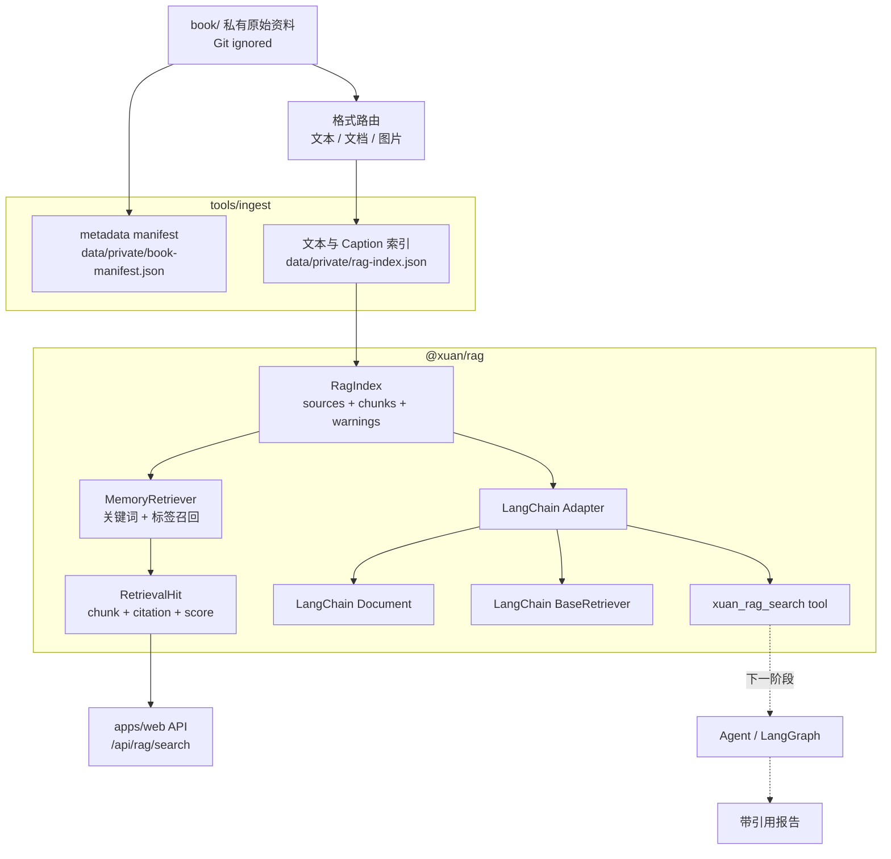
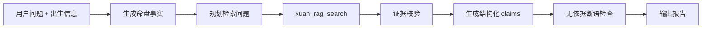

# RAG 实现报告

本文说明 XuanAgent 当前 RAG 知识层是怎么做的、代码在哪里、数据怎么流动，以及下一步如何扩展到真正的 Agentic RAG。

当前结论：

- RAG 框架方向采用 LangChain.js。
- 仓库只提交 RAG 类型、适配器、导入管道和原创说明。
- 私有书籍、OCR 文本、embedding、向量索引只能放在本地 ignored 目录。
- 当前已实现本地文本索引、关键词/标签检索、LangChain `Document` / `BaseRetriever` / tool 适配。
- 当前已接入 Docling/macOS textutil 文档 artifact，以及 OpenAI-compatible 图片 Caption artifact。
- 当前还没有接入向量库、LLM 生成报告、LangGraph 编排和 claim 级证据校验。

2026-07-13 技术决策：文档提取采用 Docling 主解析、Apache Tika 处理旧 Office、MinerU 作为复杂 PDF 可选回退。图片不使用 OCR，改用 Caption 生成语义检索材料；Caption 必须携带模型推断 trace，且不能作为确定性排盘事实。

同日 manifest 路由验证覆盖本地 83 个文件：53 个图片文件进入 Caption 路由，12 个进入 Docling 路由，14 个进入 Apache Tika 路由，2 个走原生文本，2 个暂不支持。这里只提交数量和管道代码，不提交私有文件名、正文或 Caption。

实际接入后，本机旧 Office 因缺少 Java 暂由 macOS `textutil` 处理；Apache Tika 保留为跨平台目标。正式私有索引已从 2 个来源、43 个块扩展为 5 个真实来源、1,021 个块。API Caption 使用合成图完成 smoke test，没有把私有图片发送到外部服务。

## 设计目标

XuanAgent 的 RAG 不是为了让模型自由算命，而是为了解决一个更窄的问题：

1. 排盘事实必须来自 `@xuan/core` 的确定性规则。
2. 解释文字必须引用可追溯资料。
3. 每条解释都应该能回到两个来源：
   - 命盘事实：宫位、星曜、五行局、trace 等。
   - RAG citation：`sourceId`、`chunkId`、`locator`。
4. 如果没有事实或 citation，Agent 应该拒绝断语或标记为无依据。

## 当前架构



## 代码位置

| 模块 | 文件 | 作用 |
| --- | --- | --- |
| RAG 类型 | `packages/rag/src/types.ts` | 定义 `KnowledgeSource`、`SourceChunk`、`Citation`、`RagIndex`、`Retriever` 等核心契约 |
| 本地检索器 | `packages/rag/src/memory-retriever.ts` | 当前关键词和标签召回实现 |
| Index 工厂 | `packages/rag/src/index-retriever.ts` | 从 `RagIndex` 创建本地 retriever |
| LangChain 适配 | `packages/rag/src/langchain-adapter.ts` | 把项目内 RAG 契约接到 LangChain.js |
| 私有导入工具 | `tools/ingest/src/index.ts` | 扫描 `book/`，生成 manifest 或本地 RAG index |
| 文档提取 worker | `tools/extract/worker.py` | 使用 Docling 或 macOS textutil 生成本地 extraction artifact |
| 图片 Caption | `tools/ingest/src/vision-caption.ts` | OpenAI-compatible 视觉 API、上传保护和 Caption trace |
| 文档 artifact | `tools/ingest/src/document-extraction.ts` | 校验并转换文档 extraction artifact |
| Web API | `apps/web/src/server.ts` | 暴露 RAG status/search API |
| 测试 | `packages/rag/src/*.test.ts`、`tools/ingest/src/index.test.ts` | 锁住 citation、metadata 和私有索引行为 |

## 数据模型

### KnowledgeSource

`KnowledgeSource` 描述一个来源，而不是直接描述正文。

关键字段：

- `id`：来源稳定 ID。
- `title`：书名、笔记名或资料名。
- `author`：作者或老师，可选。
- `language`：语言。
- `license`：来源许可，例如 `original`、`user-private`、`public-domain`。
- `usage`：是否能进仓库，当前最重要的是：
  - `repo-safe`：可进入仓库。
  - `local-private-only`：只能本地使用。

### SourceChunk

`SourceChunk` 是被检索的最小文本片段。

关键字段：

- `id`：chunk ID，例如 `source-id#p1-1`。
- `sourceId`：对应 `KnowledgeSource.id`。
- `locator`：定位信息，目前是段落号，后续可扩展为页码、章节、时间戳。
- `text`：片段文本。
- `tags`：主题标签，例如 `紫微斗数`、`命宫`、`主星`。

### Citation

`Citation` 是解释层真正应该依赖的引用锚点。

关键字段：

- `sourceId`
- `chunkId`
- `locator`
- `title`

报告层不应该只拿一段文本就生成结论，必须把 citation 一起带上。

### RagIndex

`RagIndex` 是当前本地索引文件结构。

```ts
interface RagIndex {
  version: 1;
  generatedAt: string;
  usage: "repo-safe" | "local-private-only";
  sources: KnowledgeSource[];
  chunks: SourceChunk[];
  warnings: string[];
}
```

本地私有索引默认写到：

```text
data/private/rag-index.json
```

这个路径被 Git 忽略，不能提交。

## 私有语料导入流程

当前导入工具在 `tools/ingest`。

### 1. 生成 metadata manifest

```bash
node tools/ingest/dist/index.js manifest book data/private/book-manifest.json
```

这一步只记录文件元数据：

- 相对路径
- 扩展名
- 文件大小
- sourceId
- 处理方式提示

它不保存正文，适合做资料盘点。

### 2. 生成本地文本 RAG index

```bash
node tools/ingest/dist/index.js index-text book data/private/rag-index.json
```

当前只处理：

- `.txt`
- `.md`

当前 `index-text` 命令仍会跳过：

- PDF
- Word
- 图片 Caption
- 压缩包

manifest 会为这些文件生成明确路由。实际 `index-private` 命令会合并原生文本、`data/private/extraction-artifacts/` 中的文档产物和 `data/private/captions/` 中的 Caption 产物。所有产物仍然只能落在 `data/private/` 或 `corpus/private/`。

```bash
node tools/ingest/dist/index.js index-private \
  book \
  data/private/captions \
  data/private/extraction-artifacts \
  data/private/rag-index.json
```

### 3. 切分策略

当前切分逻辑：

- 先按空行分段。
- 每段最长约 900 字。
- 超过长度时按固定字符窗口切开。
- locator 暂时记为 `paragraph N`。

这是一个早期可用方案。下一步应该增加：

- 页码定位。
- 章节定位。
- PDF 页码映射。
- 文档坐标或图片原图引用。
- 更适合中文古籍/讲义的语义切分。

### 4. 标签推断

当前标签主要从路径推断，例如：

- 路径含 `紫微` 或 `斗数` -> `紫微斗数`
- 路径含 `命宫` -> `命宫`
- 路径含 `四化` -> `四化`
- 路径含 `天纪` -> `天纪`
- 路径含 `四柱` -> `八字`
- 路径含 `地脉`、`罗盘`、`罗经` -> `风水`

这个方案简单但可控。后续可以加入人工 tag manifest，避免只靠路径猜测。

## 当前检索逻辑

当前检索器是 `MemoryRetriever`，不是向量库。

工作方式：

1. 把查询文本按中英文标点和空白切 token。
2. 对每个 chunk 计算分数：
   - 正文命中 token：加 1。
   - tag 文本命中 token：加 2。
   - 显式传入 `tags` 命中：加 2。
3. 过滤掉 0 分。
4. 按分数降序。
5. 取 `topK`，默认 5。
6. 为每个结果补 citation。

这让当前系统有一个足够透明的 baseline：召回为什么命中，是可以解释的。

局限：

- 不理解语义近义词。
- 不做 embedding 相似度。
- 不做 BM25。
- 不做 rerank。
- 不做流派优先级。
- 不做时间、版本、作者权重。

## LangChain.js 适配层

文件：`packages/rag/src/langchain-adapter.ts`

这一层的目的不是替代内部 RAG 契约，而是让 XuanAgent 能接入当前流行的 LangChain / LangGraph 生态。

### 1. RagIndex -> LangChain Document

`ragIndexToLangChainDocuments(index)` 会把每个 `SourceChunk` 转成 LangChain `Document`。

`pageContent` 是 chunk 文本。

`metadata` 保留：

- `sourceId`
- `chunkId`
- `locator`
- `title`
- `author`
- `language`
- `license`
- `usage`
- `tags`
- `citation`

这样后续无论进入 vector store 还是 retriever chain，引用信息都不会丢。

### 2. 本地 Retriever -> BaseRetriever

`XuanLangChainRetriever` 继承 LangChain `BaseRetriever`。

调用：

```ts
const retriever = createLangChainRetrieverFromIndex(index, { topK: 5 });
const docs = await retriever.invoke("命宫 紫微星");
```

返回的是 LangChain `Document[]`，每个 document 的 metadata 里仍有 citation 和 score。

### 3. Agent tool：xuan_rag_search

`createXuanRagLangChainToolFromIndex(index)` 会创建一个 LangChain tool。

tool 名称默认：

```text
xuan_rag_search
```

输入 schema：

- `query`：必填，检索问题。
- `tags`：可选，主题标签。
- `topK`：可选，1 到 10。

输出结构：

- `query`
- `usage`
- `groundingPolicy`
- `hits`

其中 `groundingPolicy` 固定为：

```text
chart-facts-and-citations-only
```

这相当于给后续 Agent 一个硬约束：解释层只能基于排盘事实和 citation。

## Web API

文件：`apps/web/src/server.ts`

### GET /api/rag/status

作用：检查本地 RAG index 是否可用。

返回字段：

- `ready`
- `error`
- `sourceCount`
- `chunkCount`
- `usage`
- `framework`

`framework` 当前返回：

```text
LangChain.js
```

如果找不到本地索引，会提示运行：

```bash
node tools/ingest/dist/index.js index-text book data/private/rag-index.json
```

### POST /api/rag/search

请求体：

```json
{
  "text": "命宫 紫微星",
  "tags": ["紫微斗数"],
  "topK": 5
}
```

返回字段：

- `query`
- `hits`
- `sourceCount`
- `chunkCount`
- `framework`

每个 hit 包含：

- `score`
- `citation`
- `tags`
- `snippet`

注意：Web API 会返回本地私有片段的摘要 snippet，但服务只监听 `127.0.0.1`，用于本地工作台。不要把这个 API 暴露到公网，除非先做权限、脱敏和来源授权检查。

## Web 工作台中的位置

当前页面有一个“本地 RAG”面板：

- 页面加载时调用 `/api/rag/status`。
- 输入检索问题后调用 `/api/rag/search`。
- 展示命中的 citation、score、tags 和 snippet。

这一步主要是调试入口，不是最终报告系统。最终 Agent 报告应该单独走结构化 report schema。

## 安全与版权边界

当前边界非常明确：

- `book/`：本地原始资料，ignored。
- `corpus/private/`：本地抽取文本，ignored。
- `data/private/`：manifest、索引、embedding、缓存，ignored。

禁止提交：

- 原始书籍。
- 扫描件。
- OCR 全文。
- 课程逐字稿。
- 私人笔记。
- embedding 或向量索引。
- 可还原版权文本的大段衍生内容。

允许提交：

- RAG 代码。
- 类型定义。
- 管道工具。
- 原创说明。
- 公版或授权资料的元数据。
- 必要且合规的短引用。

## 当前测试覆盖

已有测试覆盖：

- 私有 book manifest 只写 metadata，不包含正文。
- 本地 text RAG index 会生成 `local-private-only` 索引。
- PDF 等非文本资料会被跳过并写 warning。
- LangChain document metadata 保留 citation。
- LangChain retriever 可返回带 score/citation 的 document。
- `xuan_rag_search` tool 返回 `groundingPolicy` 和 citation。
- Memory retriever 支持按 tag 自由文本命中。

## 下一阶段建议

### 1. 引入真正的混合检索

当前是关键词 + tag baseline。

建议升级为：

- BM25：适合精确术语、宫位、星曜、古文关键词。
- Embedding：适合语义近义表达。
- Tag filter：适合强制限定主题，如 `命宫`、`四化`、`主星`。
- Rerank：把召回结果重新排序。

LangChain.js 可以继续作为统一接口，内部可选不同 vector store。

### 2. 增加私有 extractor 插件

按优先级：

1. PDF 文本抽取。
2. Word 文档抽取。
3. 图片 Caption，并保留原图 citation 与推断 trace。
4. 页码/章节 locator。
5. 手工修订 metadata。

所有 extractor 默认只输出到 `data/private/` 或 `corpus/private/`。

### 3. 建立 report schema

建议报告不要直接是一段 markdown，而是结构化：

```ts
interface GroundedClaim {
  id: string;
  text: string;
  factIds: string[];
  citations: Citation[];
  confidence: number;
  unsupported: boolean;
}
```

每一句判断都必须带：

- 命盘 fact ID。
- 规则 trace。
- RAG citation。
- confidence。

### 4. 接 LangGraph

推荐 LangGraph 节点：



关键点：LLM 只参与“组织语言”和“提出检索计划”，不能生成排盘事实。

### 5. 做来源质量分层

建议给来源增加质量权重：

- 公版经典。
- 现代授权教材。
- 用户私有资料。
- 用户原创笔记。
- 未知来源。

报告里应该能显示“此解释来自哪类来源”，并允许用户按来源类型过滤。

## 最小可用工作流

本地使用流程：

```bash
pnpm install
pnpm build
node tools/ingest/dist/index.js index-text book data/private/rag-index.json
node apps/web/dist/server.js
```

打开：

```text
http://127.0.0.1:4317
```

检查：

- RAG 状态是否 ready。
- source/chunk 数量是否符合预期。
- 检索结果是否带 citation。
- snippet 是否只在本地显示。

## 一句话总结

当前 RAG 层已经完成了“本地私有资料可索引、可检索、可引用、可接 LangChain”的骨架。下一步的重点不是让 LLM 更会说，而是建立 claim 级别的证据链：每条解释都必须同时绑定排盘事实和 RAG citation。
